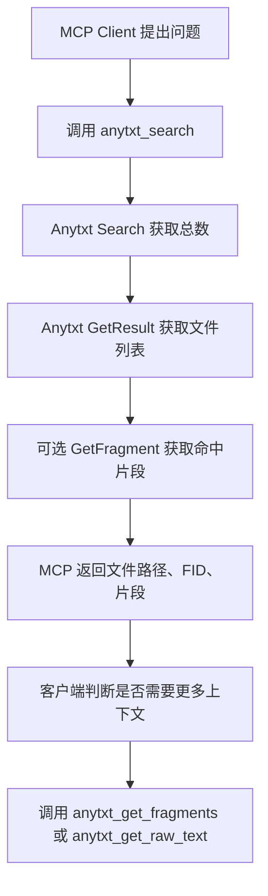

# Anytxt MCP 知识库检索服务规划

## 目标

构建一个本地 MCP Server，连接已完成索引的 Anytxt HTTP JSON-RPC API，为支持 MCP 的客户端提供知识库检索能力。

该 MCP 不负责文件索引构建和文本抽取，默认 Anytxt 已经完成索引；MCP 只作为一个安全、稳定、易用的调用层，把 Anytxt 的搜索、片段读取、全文读取能力封装成标准 MCP tools。

## 背景

Anytxt API 运行在本机 `ATGUI` 进程内，默认监听：

```text
http://127.0.0.1:9920
```

API 协议为 HTTP JSON-RPC 2.0。所有请求都发送到同一个地址，通过 `method` 字段区分能力。

基础请求结构：

```json
{
  "id": 123,
  "jsonrpc": "2.0",
  "method": "ATRpcServer.Searcher.V1.Search",
  "params": {
    "input": {}
  }
}
```

## 设计原则

- 本地优先：只连接 `127.0.0.1` 上的 Anytxt 服务。
- 只读为主：默认暴露检索能力，不默认开放索引同步和 OCR。
- 面向知识库检索：优先提供“搜索结果 + 命中片段”的高价值返回，而不是直接返回大量全文。
- 可控输出：对返回数量、片段数量、全文长度设置上限，避免 MCP 客户端上下文被撑爆。
- 明确错误：把 Anytxt 连接失败、JSON-RPC 错误、无结果、FID 无效等情况转换成清晰的 MCP 错误信息。
- 非商业用途提醒：保留 Anytxt API 的非商业使用限制说明。

## MCP 工具规划

### 1. `anytxt_search`

用于在 Anytxt 索引中搜索文件内容，返回文件列表和可选命中片段。

对应 Anytxt API：

- `ATRpcServer.Searcher.V1.Search`
- `ATRpcServer.Searcher.V1.GetResult`
- 可选调用 `ATRpcServer.Searcher.V1.GetFragment`

输入参数：

| 参数 | 类型 | 必填 | 默认值 | 说明 |
|---|---|---:|---|---|
| `query` | string | 是 | - | 搜索关键词或 Anytxt pattern |
| `directory` | string | 否 | 配置中的默认目录 | 限定搜索目录 |
| `extension` | string | 否 | `*` | 文件扩展名过滤 |
| `limit` | number | 否 | `20` | 返回文件数量 |
| `offset` | number | 否 | `0` | 分页偏移 |
| `order` | number | 否 | `0` | Anytxt 排序参数 |
| `modified_after` | number | 否 | `0` | Unix 时间戳 |
| `modified_before` | number | 否 | `2147483647` | Unix 时间戳 |
| `include_fragments` | boolean | 否 | `true` | 是否为每个结果取一个片段 |

输出建议：

```json
{
  "query": "example",
  "total": 12,
  "returned": 5,
  "results": [
    {
      "fid": "9223736511748752040",
      "path": "C:\\docs\\a.txt",
      "name": "a.txt",
      "extension": ".txt",
      "size": 12345,
      "lastModified": 1711588801,
      "fragment": "...example..."
    }
  ]
}
```

备注：

- `Search` 用于获取总数。
- `GetResult` 用于获取分页文件列表。
- 如果 `include_fragments=true`，再对结果逐个调用 `GetFragment`。
- 需要限制最大 `limit`，建议不超过 `50`。

### 2. `anytxt_get_fragments`

根据 `fid` 获取某个文件中的命中片段。

对应 Anytxt API：

- `ATRpcServer.Searcher.V1.GetFragment`
- `ATRpcServer.Searcher.V1.GetFragmentAll`

输入参数：

| 参数 | 类型 | 必填 | 默认值 | 说明 |
|---|---|---:|---|---|
| `fid` | string | 是 | - | 文件 ID，来自 `anytxt_search` |
| `query` | string | 是 | - | 搜索关键词 |
| `all` | boolean | 否 | `true` | 是否返回所有片段 |
| `max_fragments` | number | 否 | `20` | 最大片段数量 |

输出建议：

```json
{
  "fid": "9223736511748752040",
  "query": "example",
  "fragments": [
    "...example fragment 1...",
    "...example fragment 2..."
  ]
}
```

### 3. `anytxt_get_raw_text`

根据 `fid` 获取文件完整文本。

对应 Anytxt API：

- `ATRpcServer.Searcher.V1.GetRawTextByFID`

输入参数：

| 参数 | 类型 | 必填 | 默认值 | 说明 |
|---|---|---:|---|---|
| `fid` | string | 是 | - | 文件 ID，来自 `anytxt_search` |
| `max_chars` | number | 否 | `20000` | 最大返回字符数 |

输出建议：

```json
{
  "fid": "9223736511748752040",
  "text": "raw extracted text...",
  "truncated": true,
  "max_chars": 20000
}
```

备注：

- 该工具可能返回大量内容，应默认截断。
- 如果客户端确实需要全文，可显式提高 `max_chars`，但仍应设置服务端硬上限。

### 4. `anytxt_sync_index`

主动同步指定目录的 Anytxt 索引。

对应 Anytxt API：

- `ATRpcServer.Searcher.V1.SyncIndex`

输入参数：

| 参数 | 类型 | 必填 | 默认值 | 说明 |
|---|---|---:|---|---|
| `folder` | string | 是 | - | 要同步的本机目录 |

默认建议：

- 第一版可以不启用，或通过配置项 `ANYTXT_ENABLE_SYNC=true` 才暴露。
- 知识库索引已构建完成时，该工具不是必须能力。

### 5. `anytxt_ocr`

对图片文件执行离线 OCR。

对应 Anytxt API：

- `ATRpcServer.Searcher.V1.OCR`

输入参数：

| 参数 | 类型 | 必填 | 默认值 | 说明 |
|---|---|---:|---|---|
| `file` | string | 是 | - | 图片文件路径 |

默认建议：

- OCR 仅 Anytxt OCR 版本可用，第一版可不启用。
- 通过配置项 `ANYTXT_ENABLE_OCR=true` 控制是否暴露。

## 推荐第一版工具集

第一版建议只实现 3 个核心工具：

```text
anytxt_search
anytxt_get_fragments
anytxt_get_raw_text
```

原因：

- 已满足知识库检索主流程。
- 避免索引同步带来的耗时和状态复杂度。
- 避免 OCR 版本差异导致工具不稳定。

后续再按需要打开：

```text
anytxt_sync_index
anytxt_ocr
```

## 知识库检索流程

标准调用流程：



## 配置项

建议使用环境变量：

| 环境变量 | 默认值 | 说明 |
|---|---|---|
| `ANYTXT_RPC_URL` | `http://127.0.0.1:9920` | Anytxt JSON-RPC 地址 |
| `ANYTXT_DEFAULT_DIR` | 空 | 默认搜索目录 |
| `ANYTXT_DEFAULT_EXT` | `*` | 默认扩展名过滤 |
| `ANYTXT_TIMEOUT_MS` | `10000` | HTTP 请求超时 |
| `ANYTXT_MAX_RESULTS` | `50` | 单次最大搜索结果数 |
| `ANYTXT_MAX_FRAGMENTS` | `20` | 单文件最大片段数 |
| `ANYTXT_MAX_RAW_CHARS` | `20000` | 全文最大返回字符数 |
| `ANYTXT_ENABLE_SYNC` | `false` | 是否启用同步索引工具 |
| `ANYTXT_ENABLE_OCR` | `false` | 是否启用 OCR 工具 |

## Anytxt RPC 客户端封装

建议 MCP 内部封装一个 `AnytxtClient`，统一处理：

- JSON-RPC 请求结构。
- 自增或随机请求 `id`。
- HTTP 超时。
- JSON 解析。
- JSON-RPC `error` 转换。
- Anytxt 返回结构归一化。

伪代码：

```ts
class AnytxtClient {
  async call(method: string, input: unknown): Promise<unknown> {
    const response = await fetch(this.url, {
      method: "POST",
      headers: {
        "Accept": "application/json",
        "Content-Type": "application/json"
      },
      body: JSON.stringify({
        id: Date.now(),
        jsonrpc: "2.0",
        method,
        params: { input }
      }),
      signal: timeoutSignal(this.timeoutMs)
    });

    const data = await response.json();
    if (data.error) {
      throw new Error(data.error.message || "Anytxt JSON-RPC error");
    }
    return data.result;
  }
}
```

## 参数处理策略

### `query`

直接传给 Anytxt 的 `pattern` 字段。

需要在工具描述中说明：

- 普通关键词可以直接传入，例如 `Hello`。
- 精确短语可使用 Anytxt 的引号语法，例如 `"This is"`。
- MCP 不应擅自改写 query，避免破坏 Anytxt 搜索语法。

### `directory`

如果未传入：

1. 使用 `ANYTXT_DEFAULT_DIR`。
2. 如果默认目录为空，则传空字符串或根目录需要实测决定。

建议第一版要求配置 `ANYTXT_DEFAULT_DIR`，这样可以避免误搜整个磁盘。

### `extension`

默认传 `*`。

可支持：

- `*`
- `txt`
- `.txt`
- `*.txt`
- `pdf;docx;txt`，如果 Anytxt 支持多扩展名语法，需要实测确认。

第一版建议只做轻量归一化：

- 空值转 `*`。
- `.txt` 转 `*.txt`。
- `txt` 转 `*.txt`。
- `*` 保持不变。

## 错误处理

需要覆盖以下场景：

| 场景 | 对外错误信息 |
|---|---|
| Anytxt 未启动 | 无法连接 Anytxt，请确认 ATGUI 正在运行且监听 127.0.0.1:9920 |
| 请求超时 | Anytxt 请求超时，请缩小搜索范围或稍后重试 |
| JSON-RPC error | 返回 Anytxt 原始错误信息 |
| 搜索无结果 | 返回空 results，不作为异常 |
| `fid` 无效 | 未找到该 FID 对应的文件文本或片段 |
| 返回文本过长 | 正常返回并标记 `truncated=true` |

## 安全边界

- 默认只连接本机 `127.0.0.1`。
- 不把 Anytxt 服务暴露到外网。
- 不在 MCP 中执行任意文件读写。
- 不默认开启 `SyncIndex`，避免客户端触发大范围扫描。
- 不默认开启 `OCR`，避免误处理敏感图片。
- 日志中不要记录完整文件正文，只记录方法、耗时、结果数量和错误摘要。

## 技术选型建议

如果当前项目从零开始，推荐使用 TypeScript 实现：

```text
Node.js + TypeScript + @modelcontextprotocol/sdk
```

原因：

- MCP 官方 SDK 支持成熟。
- JSON Schema 工具定义清晰。
- fetch 调用 JSON-RPC 简单。
- 便于打包为本地命令。

建议目录结构：

```text
AnytxtMCP/
  package.json
  tsconfig.json
  src/
    index.ts
    config.ts
    anytxt-client.ts
    tools/
      search.ts
      fragments.ts
      raw-text.ts
      sync-index.ts
      ocr.ts
  docs/
    anytxt-mcp-plan.md
```

## 实现步骤

1. 初始化 Node.js + TypeScript 项目。
2. 引入 MCP SDK。
3. 实现配置读取和默认值。
4. 实现 `AnytxtClient.call()`。
5. 实现 `anytxt_search`。
6. 实现 `anytxt_get_fragments`。
7. 实现 `anytxt_get_raw_text`。
8. 增加连接失败、超时、空结果测试。
9. 用本机 Anytxt 服务做真实联调。
10. 按需增加 `anytxt_sync_index` 和 `anytxt_ocr`。

## 联调测试用例

### 连接测试

调用 `anytxt_search`，使用一个确定存在的关键词。

期望：

- 返回 `total > 0`。
- `results` 中包含 `fid`。
- 如果启用片段，返回 `fragment`。

### 无结果测试

搜索一个随机字符串。

期望：

- `total = 0`。
- `results = []`。
- 不抛异常。

### 片段测试

使用搜索结果中的 `fid` 调用 `anytxt_get_fragments`。

期望：

- 返回一个或多个片段。
- 片段中包含搜索关键词或相关上下文。

### 全文测试

使用搜索结果中的 `fid` 调用 `anytxt_get_raw_text`。

期望：

- 返回 `text`。
- 当文本超过限制时，`truncated=true`。

### Anytxt 未启动测试

关闭 Anytxt 后调用搜索。

期望：

- 返回清晰错误：无法连接 Anytxt。

## 待确认问题

- `GetResult` 返回字段的准确结构，需要用真实 Anytxt 响应确认。
- `Search` 返回总数的位置和字段名，需要实测确认。
- `GetFragmentAll` 返回值是数组、字符串数组，还是对象数组，需要实测确认。
- `filterDir` 为空时 Anytxt 的行为需要确认。
- `filterExt` 是否支持多扩展名需要确认。
- `order` 参数文档存在疑似笔误，`filterDir DESC` 的值需要实测。

## 最小可用版本验收标准

- MCP Server 能被客户端启动。
- `anytxt_search` 能搜索已索引知识库。
- 搜索结果包含 `fid`、文件路径或文件名、命中片段。
- `anytxt_get_fragments` 能基于 `fid` 返回命中上下文。
- `anytxt_get_raw_text` 能基于 `fid` 返回截断后的全文。
- Anytxt 未启动时返回可理解错误。
- 默认不会执行索引同步或 OCR。

